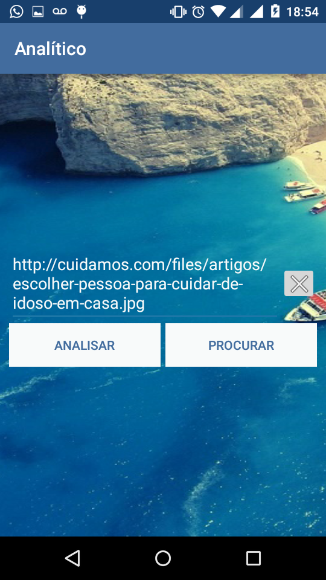

#Analítico App

Aplicativo para análise de imagem de pessoas. Aplicativo Android desenvolvido para analisar fotos com base em uma URL fornecida. O aplicativo recebe uma URL e faz uma requisição para a API responsável por processar a imagem a [FacePlusPlus](https://market.mashape.com/faceplusplus/faceplusplus-face-detection), a FacePlusPlus requer um token de autenticação que pode ser obtido fazendo um rápido cadastro no site da prorpria API. Nossa requisição deve conter a URL da foto e quais atributos (dados) que desejamos receber sobre a mesma. A requisição é feita através de uma outra API conhecida como [Retrofit](http://square.github.io/retrofit/).

Vídeo demonstrativo: [https://youtu.be/7kD8xExdV30](https://youtu.be/7kD8xExdV30)

